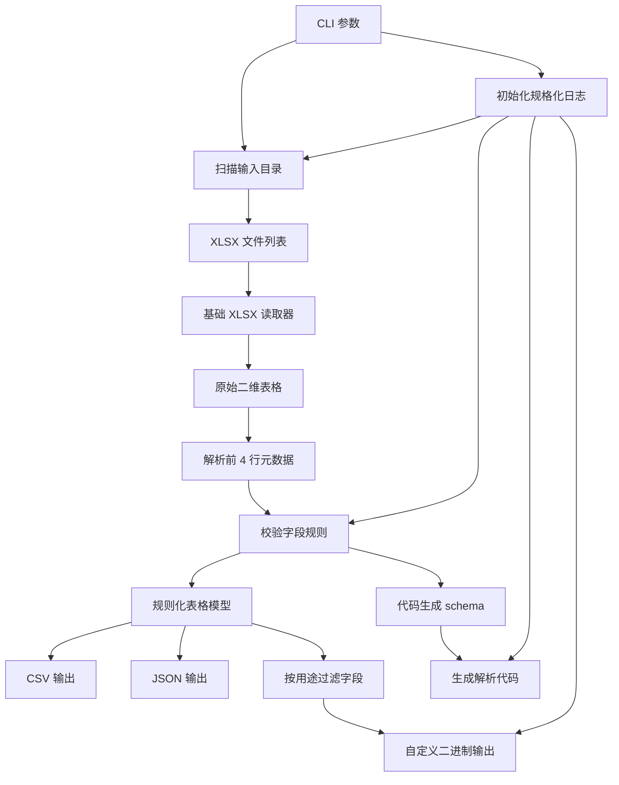

# Excel CLI MVP Plan

## 目标

构建一个跨平台命令行工具，用于批量扫描目录中的规则化 `.xlsx` 文件，校验固定表头规则，并从第 5 行开始读取数据内容，转换输出为 `.csv`、`.json`、自定义二进制格式以及对应的解析代码。工具本身编译为单个可执行文件，优先使用 Go 标准库，不引入第三方运行时或依赖库。

## 关键约束

- 技术栈：Go + 标准库。
- 运行方式：独立可执行文件，支持 Windows、Linux、macOS。
- 输入方式：目录批量处理。
- 输出格式：CSV、JSON、自定义二进制、解析代码。
- 表格规则：至少 5 行，前 4 行为字段元数据，第 5 行开始为数据内容，表头中必须定义唯一 key 字段。
- 日志输出：支持不同日志级别，并输出规格化日志。
- 文档同步：每次修改工具代码时，必须同步更新对应使用文档。
- XLSX 范围：MVP 只支持基础单元格值读取，不处理样式、图表、宏、公式计算和复杂 Excel 特性。
- 本机准备：当前环境未检测到可用 `go` 命令，正式实现前需要安装 Go 并加入 `PATH`。

## MVP 功能边界

MVP 阶段优先完成一条可靠的批量转换链路，而不是追求完整 Excel 行为。

必须支持：

- 递归或非递归扫描输入目录中的 `.xlsx` 文件。
- 默认导出所有 sheet，也可通过 `--sheet` 指定导出单个 sheet。
- 读取字符串、数字、布尔值和空单元格。
- 支持 shared strings，即 Excel 中常见的共享字符串表。
- 校验每个表至少包含 5 行。
- 解析第 1 行字段名、第 2 行字段类型、第 3 行字段用途、第 4 行字段注释。
- 从第 5 行开始读取真实数据。
- 对字段名、字段类型、字段用途做规则校验。
- 通过第 1 行字段名中的 `*` 标识唯一 key 字段，并校验第 5 行以后的 key 值非空且不重复。
- 支持备注列，备注列不写入二进制文件。
- 基于前 4 行字段元数据生成解析代码所需的 schema 描述。
- 输出 CSV、JSON、bin 三种格式。
- 支持导出解析代码骨架，MVP 目标语言优先实现 C#。
- 单个 sheet 导出为一个单独二进制文件；单个 Excel 文件导出为一个单独代码文件。
- 支持 `debug`、`info`、`warn`、`error` 日志级别。
- 支持文本或 JSON 格式的规格化日志。
- 执行结束后打印处理摘要。

暂不支持：

- `.xls` 旧版二进制 Excel 文件。
- 宏文件 `.xlsm`。
- 公式计算，只读取文件中已有缓存值。
- 样式、字体、颜色、图表、图片、批注。
- 合并单元格还原。
- 按 Excel 显示格式还原日期和数字格式。

## Excel 表格规则

每个工作表至少需要 5 行：

- 第 1 行：字段名。
- 第 2 行：字段类型。
- 第 3 行：字段用途。
- 第 4 行：字段注释说明。
- 第 5 行及以后：数据内容。

唯一 key 规则：

- 每个 sheet 必须且只能定义一个唯一 key 字段。
- key 标识写在第 1 行字段名中，用 `*` 表示。
- MVP 支持 `*id` 或 `id*` 两种写法，解析后规范化字段名为 `id`。
- 唯一 key 字段用于生成行级索引，后续可通过 key 获取整行数据。
- 第 5 行及以后，该字段值不能为空。
- 同一个 sheet 内 key 值不能重复。
- key 字段必须参与二进制输出，不能标记为 `comment`。
- MVP 建议 key 字段类型限制为 `int`、`int32`、`int64`、`string`，避免浮点、时间、泛型类型带来比较和序列化歧义。
- `comment` 用途的说明字段即使字段名带 `*` 也无效，并应报错。

字段名规则：

- 必须是合法标识符。
- 建议 MVP 使用通用规则：去除首尾 `*` 后必须匹配 `^[A-Za-z_][A-Za-z0-9_]*$`。
- 字段名不能为空。
- 同一个 sheet 内字段名不能重复。
- 备注列也需要有字段名，方便错误定位和文档输出。
- 字段名中除 key 标识用的首尾 `*` 外，不允许出现其他 `*`。

字段类型规则：

- 基础类型：`bool`、`int`、`int32`、`int64`、`float`、`double`、`string`、`bytes`。
- 时间日期类型：仅支持 `datetime`，格式固定为 `YYYY-MM-DD HH:mm:ss`。
- 泛型引用类型：MVP 建议先支持字符串解析和结构保留，例如 `array<int>`、`array<string>`、`map<string,int>`、`ref<Item>`。
- 类型名大小写建议统一为小写，解析时可以先做 trim。
- 不认识的类型默认报错，不静默降级为字符串。

数据单元格格式规则：

- `bool`：仅支持 `true`、`false`、`1`、`0`，大小写不敏感。
- `int`、`int32`、`int64`：支持负整数，二进制使用 protobuf `sint32`、`sint64` 风格的 ZigZag + varint 编码。
- `float`、`double`：按十进制文本解析。
- `datetime`：仅支持 `YYYY-MM-DD HH:mm:ss`，例如 `2026-07-10 18:47:00`。
- `array<T>`：单元格内使用 `|` 分割元素，例如 `1|2|3`、`a|b|c`。
- `map<K,V>`：单元格内使用 `key:value|key:value`，例如 `a:1|b:2`。
- `ref<Item>`：表示引用 `Item` 表中的 key 值。单元格只填写目标行 key，例如 `1001`；含义是引用 `Item` 表 key 为 `1001` 的整行数据。若 `Item` 的 key 是字符串，也可填写 `sword_001`。
- `ref<Item>` 需要支持引用校验，可通过 `--check-ref` 检查引用表是否存在，以及引用 key 是否存在。
- 类型转换失败需要报错提示，但使用该类型默认值继续导出。
- key 字段不可为空；其他字段允许为空，空值按默认值处理。

默认值规则：

- `bool`：`false`。
- `int`、`int32`、`int64`：`0`。
- `float`、`double`：`0`。
- `string`：空字符串 `""`。
- `datetime`：元年秒级时间戳。
- `array<T>`、`map<K,V>`、`ref<T>` 等引用或复合类型：`null`。
- 第 5 行以后的整行空行可以跳过，但必须输出明确 `warn` 日志。

字段用途规则：

- `client`：仅客户端使用。
- `server`：仅服务器使用。
- `both`：客户端和服务器都可用。
- `comment`：仅备注，不写入二进制文件。

字段用途需要做冗余性设计，降低 Excel 填写成本：

- 解析前先执行 trim，去除首尾空白。
- 大小写不敏感，统一转为小写后再解析。
- 支持中英文逗号、分号、竖线、斜杠等分隔符，例如 `client,server`、`CLIENT|SERVER`、`client；server`。
- 支持组合标记顺序无关，例如 `client,server` 和 `server,client` 等价。
- 解析后必须规范化为内部枚举：`client`、`server`、`both`、`comment`。
- 如果同一单元格中出现冲突用途，例如 `client,server`，MVP 建议规范化为 `both`。
- 如果用途为空，MVP 建议报错，不自动猜测，避免数据误导出。

建议支持的别名：

- `c` 等同于 `client`。
- `cli` 等同于 `client`。
- `clientonly` 等同于 `client`。
- `s` 等同于 `server`。
- `srv` 等同于 `server`。
- `serveronly` 等同于 `server`。
- `cs`、`all` 等同于 `both`。
- `both`、`all`、`common`、`shared` 等同于 `both`。
- `note`、`remark`、`ignore`、`skip` 等同于 `comment`。

字段注释规则：

- 第 4 行内容作为字段说明。
- 注释可以为空，但建议在 README 中提示尽量填写。
- 后续如果增加代码生成，字段注释可直接写入生成代码的字段注释中。
- 字段注释需要参与 schema 输出，作为解析代码字段注释来源。

前 4 行合法性检测不仅用于判断 Excel 是否可转换，也作为解析代码生成的输入契约。只有字段名、类型、用途、注释解析完成并通过校验后，才允许生成二进制文件和解析代码。

解析后的统一模型建议：

```text
Workbook
  SourceFile
  Sheet
    Name
    Fields
      Name
      Type
      Usage
      IsKey
      Comment
      ColumnIndex
    Rows
      RowIndex
      Key
      Values
```

## 建议目录结构

- [cmd/iotaexcel/main.go](cmd/iotaexcel/main.go)：CLI 入口，解析命令和参数。
- [internal/xlsx/reader.go](internal/xlsx/reader.go)：使用 `archive/zip` 和 `encoding/xml` 读取基础 `.xlsx` 内容。
- [internal/schema/parser.go](internal/schema/parser.go)：解析前 4 行字段元数据。
- [internal/schema/validator.go](internal/schema/validator.go)：校验字段名、字段类型、字段用途和最小行数。
- [internal/schema/types.go](internal/schema/types.go)：定义基础类型、时间日期类型和泛型引用类型解析结果。
- [internal/codegen/generator.go](internal/codegen/generator.go)：定义解析代码生成接口。
- [internal/codegen/schema.go](internal/codegen/schema.go)：将 Excel 前 4 行元数据转换为语言无关的代码生成 schema。
- [internal/codegen/csharp/](internal/codegen/csharp/)：C# 解析代码生成后端，作为 MVP 优先目标语言。
- [internal/codegen/templates/](internal/codegen/templates/)：后续按目标语言组织代码模板。
- [internal/logging/logger.go](internal/logging/logger.go)：基于 Go 标准库 `log/slog` 初始化规格化日志。
- [internal/logging/fields.go](internal/logging/fields.go)：统一日志字段名，避免各模块随意输出。
- [internal/convert/csv.go](internal/convert/csv.go)：输出 CSV。
- [internal/convert/json.go](internal/convert/json.go)：输出 JSON。
- [internal/convert/binary.go](internal/convert/binary.go)：输出自定义二进制格式。
- [internal/batch/walker.go](internal/batch/walker.go)：递归扫描目录、过滤文件、组织输出路径。
- [internal/ignore/parser.go](internal/ignore/parser.go)：解析 `.iotaignore`，采用类似 `.gitignore` 的忽略规则。
- [internal/model/table.go](internal/model/table.go)：统一的表格数据结构。
- [.iotaignore](.iotaignore)：项目级忽略规则文件，用于过滤不需要处理的 Excel 文件或目录。
- [README.md](README.md)：使用说明、限制说明和示例命令，代码变更时必须同步更新。
- [docs/format.md](docs/format.md)：Excel 表头规则、字段类型、字段用途、key 规则和 TLV 二进制格式说明。
- [docs/codegen.md](docs/codegen.md)：解析代码生成规则、schema 结构和多语言扩展约定。
- [docs/logging.md](docs/logging.md)：日志级别、日志格式和规格化字段说明。
- [docs/contributing.md](docs/contributing.md)：贡献说明，包含 Git 提交格式规范、文档同步要求和验证步骤。
- [.github/pull_request_template.md](.github/pull_request_template.md)：PR checklist，提醒检查文档是否同步。
- [scripts/check-docs.ps1](scripts/check-docs.ps1)：Windows 轻量文档同步检查脚本。
- [scripts/check-docs.sh](scripts/check-docs.sh)：Linux/macOS 轻量文档同步检查脚本。

## 命令设计

MVP 使用一个主命令 `convert`：

```bash
iotaexcel convert --input ./excels --output ./out --format csv
iotaexcel convert --input ./excels --output ./out --format json
iotaexcel convert --input ./excels --output ./out --format bin
iotaexcel convert --input ./excels --output ./out --format bin --target client
iotaexcel codegen --input ./excels --output ./generated --lang csharp
```

核心参数：

- `--input`：输入目录。
- `--output`：输出目录。
- `--format`：输出格式，支持 `csv`、`json`、`bin`。
- `--recursive`：是否递归扫描子目录，默认开启。
- `--sheet`：可选，指定 sheet 名称或索引；不指定时默认导出所有 sheet。
- `--overwrite`：是否覆盖已有输出文件，默认不覆盖。
- `--target`：二进制输出目标，支持 `client`、`server`、`both`，默认 `both`。
- `--check-ref`：是否检查 `ref<T>` 引用表和 key 是否存在，默认关闭。
- `--strict`：严格模式，遇到字段错误或数据类型错误时当前文件失败，默认开启。
- `--log-level`：日志级别，支持 `debug`、`info`、`warn`、`error`，默认 `info`。
- `--log-format`：日志格式，支持 `text`、`json`，默认 `text`。
- `--log-file`：可选，指定日志文件路径；不指定时输出到标准错误流。

`codegen` 命令参数：

- `--input`：输入目录或单个 `.xlsx` 文件。
- `--output`：生成代码输出目录。
- `--lang`：目标语言，MVP 优先支持 `csharp`。
- `--target`：生成客户端、服务器或通用解析代码，支持 `client`、`server`、`both`。
- `--package`：生成代码的包名、命名空间或模块名；C# 默认命名空间为 `DataConfig`。
- `--sheet`：可选，指定参与代码生成的 sheet；不指定时默认处理所有合法 sheet。
- `--check-ref`：是否检查 `ref<T>` 引用表和 key 是否存在，默认关闭。

通用日志参数适用于 `convert`、`codegen`、后续新增命令：

```bash
iotaexcel convert --input ./excels --output ./out --format bin --log-level debug
iotaexcel convert --input ./excels --output ./out --format json --log-format json
iotaexcel codegen --input ./excels --output ./generated --lang csharp --log-file ./iotaexcel.log
```

建议补充命令：

```bash
iotaexcel version
iotaexcel help
```

建议行为：

- `--input` 不存在时直接失败。
- `--output` 不存在时自动创建。
- 扫描输入目录时读取 `.iotaignore`，按类似 `.gitignore` 的规则过滤文件和目录。
- 默认跳过 Excel 临时文件，例如 `~$example.xlsx`。
- 输出文件已存在且未设置 `--overwrite` 时跳过该文件。
- 输入目录中没有 `.xlsx` 文件时返回成功，但提示没有可处理文件。
- 单个文件失败不影响其他文件继续处理，最终摘要中列出失败文件。
- 默认处理所有 sheet，`--sheet` 指定时只处理匹配 sheet。
- 批量导出时保留输入目录下的相对子目录结构。
- 单个 sheet 导出为一个单独二进制文件。
- 单个 Excel 文件导出为一个单独代码文件。
- 二进制文件和代码文件输出路径都必须包含相对子目录结构，避免不同目录同名文件互相覆盖。
- 如果出现同名文件且同名 sheet 导致输出路径冲突，需要输出 `warn` 日志；未开启 `--overwrite` 时跳过，开启后覆盖。
- 表格少于 5 行时当前文件失败。
- 字段名、字段类型、字段用途非法时当前文件失败。
- Excel 文件名用于生成代码文件名，sheet 名用于生成类名或结构体名；二者都必须通过严格标识符命名规则检测，不符合时当前文件停止导出。
- `comment` 用途列不写入二进制文件，但可以保留在 JSON 元数据中。
- `codegen` 必须复用同一套 schema 校验逻辑，不能绕过 Excel 合法性检测。
- 如果 schema 校验失败，不生成对应解析代码。
- 日志默认输出到标准错误流，避免污染 CSV、JSON 等标准输出内容。
- 最终处理摘要既要有人类可读输出，也要有规格化日志事件。

汇总信息需要包含：

- 成功文件数。
- 失败文件数。
- 跳过文件数。
- 成功文件列表。
- 失败文件列表及原因。
- 跳过文件列表及原因。
- 类型转换错误数量。
- 使用默认值次数。
- ref 校验错误数量。
- 输出文件列表。

## 日志设计

日志方案优先使用 Go 标准库 `log/slog`，不引入第三方日志库。

日志级别：

- `debug`：输出详细调试信息，例如扫描到的文件、解析 sheet、字段过滤详情。
- `info`：输出正常关键流程，例如开始任务、处理文件、生成产物、完成摘要。
- `warn`：输出可恢复问题，例如跳过已存在文件、发现空目录、跳过备注列。
- `error`：输出文件处理失败、schema 校验失败、写入失败等错误。

日志格式：

- `text`：适合本地人工查看。
- `json`：适合 CI、脚本、日志平台采集。

规格化日志字段建议：

- `time`：日志时间。
- `level`：日志级别。
- `msg`：事件描述。
- `command`：当前命令，例如 `convert`、`codegen`。
- `source`：当前 Excel 文件路径。
- `sheet`：当前 sheet 名称或索引。
- `format`：输出格式，例如 `csv`、`json`、`bin`。
- `target`：目标用途，例如 `client`、`server`、`both`。
- `output`：输出文件路径。
- `field`：字段名。
- `row`：Excel 行号。
- `column`：Excel 列号。
- `error`：错误信息。
- `duration_ms`：耗时毫秒。

JSON 日志示例：

```json
{
  "time": "2026-07-10T17:54:00+08:00",
  "level": "ERROR",
  "msg": "schema validation failed",
  "command": "convert",
  "source": "excels/Item.xlsx",
  "sheet": "Sheet1",
  "field": "1id",
  "row": 1,
  "column": 2,
  "error": "invalid identifier"
}
```

日志输出约定：

- 业务产物只写入 `--output` 指定目录。
- 日志默认写入标准错误流。
- `--log-file` 存在时写入指定文件，必要时自动创建父目录。
- 参数解析失败时也要输出明确错误日志。
- 批处理场景下，单文件失败记录 `error` 日志，但继续处理其他文件。
- 命令结束时输出 `summary` 事件，包含成功数、失败数、跳过数和总耗时。

## 文档同步规则

每次修改工具代码，都需要同步更新对应使用文档。文档更新是完成标准的一部分，不作为可选收尾事项。

必须同步更新文档的场景：

- 新增、删除或修改 CLI 命令、参数、默认值。
- 修改 Excel 表头规则、字段类型、字段用途、key 定义方式。
- 修改 CSV、JSON、bin 输出格式。
- 修改 TLV 字段编号、wire type、schemaHash、二进制版本等编码规则。
- 修改 codegen schema、生成代码接口或目标语言支持。
- 修改日志级别、日志格式、日志字段。
- 修改错误码、退出行为、覆盖策略、批处理失败策略。
- 修改构建、发布、安装方式。

文档放置建议：

- `README.md` 保持面向使用者：快速开始、常用命令、示例和限制。
- `docs/format.md` 记录 Excel 和二进制格式契约。
- `docs/codegen.md` 记录解析代码生成契约。
- `docs/logging.md` 记录日志参数和规格化日志字段。
- `docs/contributing.md` 记录 Git 提交格式规范和本地验证步骤。

验收要求：

- 代码变更的 PR 或提交中应包含对应文档变更。
- 如果某次代码变更不影响用户可见行为或格式契约，需要在变更说明中明确“不需要更新文档”的原因。
- README 示例命令必须能反映当前 CLI 参数。
- 格式文档必须和测试用例中的实际编码规则一致。
- PR checklist 必须包含文档同步确认项。
- PR checklist 必须包含 Git 提交格式确认项。
- docs 检查脚本需要作为本地验证步骤之一，避免完全依赖人工记忆。

轻量检查建议：

PR checklist：

```markdown
## Checklist

- [ ] 已更新代码相关测试
- [ ] 已同步更新 README 或 docs
- [ ] 如未更新文档，已说明原因
- [ ] Git 提交信息符合项目提交格式规范
- [ ] CLI 参数、Excel 规则、TLV 格式、日志字段、codegen schema 的示例仍然准确
```

docs 检查脚本 MVP 可以先做低成本检查：

- 检查 `README.md`、`docs/format.md`、`docs/codegen.md`、`docs/logging.md` 是否存在。
- 检查 README 中是否包含核心命令示例：`convert`、`codegen`。
- 检查 `docs/format.md` 是否包含关键术语：`datetime`、`ZigZag`、`schemaHash`、`fieldNo`、`sharedStrings`。
- 检查 `docs/logging.md` 是否包含 `--log-level`、`--log-format`、`--log-file`。
- 检查 `docs/codegen.md` 是否包含 `CodegenSchema`、`fieldNo`、`wireType`。
- 检查 `docs/contributing.md` 是否包含 Git 提交格式规范。

后续如果接入 CI，可以把 docs 检查脚本加入 CI，但 MVP 不强制。

## Git 提交格式规范

项目建议采用简化版 Conventional Commits，提交信息格式：

```text
<type>(<scope>): <summary>
```

其中：

- `type` 表示变更类型。
- `scope` 表示影响范围，可选但建议填写。
- `summary` 使用简短中文或英文描述，建议不超过 72 个字符。

推荐类型：

- `feat`：新增功能。
- `fix`：修复问题。
- `docs`：文档变更。
- `test`：测试变更。
- `refactor`：不改变行为的重构。
- `build`：构建、依赖、发布相关变更。
- `ci`：CI 或自动化流程变更。
- `chore`：其他维护性变更。

推荐 scope：

- `cli`：命令行参数或入口。
- `xlsx`：XLSX 读取。
- `schema`：表头规则、类型、用途、key 校验。
- `binary`：`.bytes` 二进制格式。
- `codegen`：C# 代码生成。
- `logging`：日志。
- `docs`：使用文档。
- `ignore`：`.iotaignore` 忽略规则。
- `release`：构建和发布。

示例：

```text
feat(schema): 支持字段名星号标记唯一 key
fix(binary): 修正 sint64 ZigZag 编码
docs(format): 补充 ref<Item> 单元格示例
test(logging): 覆盖 JSON 日志级别过滤
```

提交要求：

- 每次提交尽量聚焦一个主题。
- 修改 CLI、Excel 规则、二进制格式、codegen、日志或错误码时，同一提交应包含对应文档更新。
- 如果代码变更不需要文档更新，应在 PR 描述中说明原因。
- 不提交构建产物、临时文件、Excel `~$` 文件和本地日志文件。
- 不使用无意义提交信息，例如 `update`、`fix bug`、`wip`。

## 忽略规则

工具支持项目级 `.iotaignore` 文件，用于声明不参与扫描和导出的文件或目录。规则参考 `.gitignore` 的常见写法，但 MVP 可以先实现轻量子集。

建议支持：

- 空行和以 `#` 开头的注释。
- 目录忽略，例如 `temp/`。
- 文件名匹配，例如 `*.bak.xlsx`。
- 路径匹配，例如 `legacy/*.xlsx`。
- 默认忽略 Excel 临时文件，例如 `~$*.xlsx`。

MVP 暂不要求完整兼容 `.gitignore` 的所有高级语义，例如复杂否定规则和双星递归规则；如支持范围有限，需要在 `docs/format.md` 或 README 中说明。

## XLSX 读取边界

MVP 需要支持 `sharedStrings`。这是 `.xlsx` 中常见的字符串存储方式：单元格本身只保存共享字符串表的索引，真实文本保存在 `xl/sharedStrings.xml` 中。

示例：

```text
sharedStrings[0] = "id"
worksheet cell A1 = shared string index 0
最终读取值 = "id"
```

`inlineStr` 是另一种字符串存储方式：字符串直接写在单元格 XML 内，而不是放在共享字符串表中。

示例：

```xml
<c r="A1" t="inlineStr">
  <is><t>id</t></is>
</c>
```

MVP 阶段优先保证 `sharedStrings`，并在文档中明确 `inlineStr`、富文本、复杂公式缓存等能力是否支持。若实现成本可控，可以把 `inlineStr` 作为兼容项加入基础读取器；若暂不支持，遇到时应给出明确错误或警告，不能静默读空。

还需要处理 sparse cell。Excel XML 可能只写非空单元格，例如一行里只有 `A1` 和 `C1`，没有 `B1` 节点。读取器需要根据单元格坐标补齐中间空值，保证列位置和字段元数据对齐。

## 解析代码生成设计

解析代码生成基于前 4 行字段元数据，而不是基于第 5 行以后的具体数据。这样可以保证生成代码和二进制编码规则稳定绑定。

生成输入：

- 字段名：生成结构体字段、属性或对象键。
- 字段类型：决定解析函数读取的目标类型。
- 字段用途：决定该目标是否包含该字段。
- 字段注释：生成字段注释。
- 二进制编码规则：决定字段编号、wire type 和读取函数。

语言无关 schema 建议：

```json
{
  "source": "Item.xlsx",
  "sheet": "Sheet1",
  "target": "client",
  "key": {
    "name": "id",
    "type": "int"
  },
  "fields": [
    {
      "name": "id",
      "type": "int",
      "usage": "both",
      "comment": "唯一 ID",
      "key": true,
      "fieldNo": 1,
      "wireType": 0,
      "binary": true,
      "order": 0
    }
  ]
}
```

生成代码应遵循以下原则：

- 生成代码只依赖目标语言标准库，延续小包体和独立分发目标。
- 字段编号和 wire type 必须和二进制写入规则一致。
- 生成代码需要包含按唯一 key 获取整行数据的接口。
- MVP 优先生成 C# 代码。
- Excel 文件名对应代码文件名，sheet 名对应类名或结构体名。
- Excel 文件名和 sheet 名必须通过严格标识符命名规则检测；不符合时直接报错并停止导出。
- `comment` 字段不生成二进制读取逻辑。
- `client` 目标只生成 `client` 和 `both` 字段。
- `server` 目标只生成 `server` 和 `both` 字段。
- 类型映射通过独立表维护，避免散落在模板中。
- 生成文件顶部包含 schema 版本、工具版本和来源 Excel 文件名，方便排查不匹配问题。

多语言 codegen 架构建议：

```text
Generator interface
  Language() string
  Generate(schema CodegenSchema) []GeneratedFile

CodegenSchema
  Source
  Sheet
  Target
  KeyField
  Fields
  BinaryVersion
  SchemaHash

Language backend
  TypeMapper
  NameFormatter
  TemplateRenderer
```

MVP 阶段先完成语言无关 schema 和 C# 生成后端。后续可按实际需要扩展 Go、TypeScript 等语言。

C# 命名建议：

- Excel 文件名去除扩展名后作为代码文件名来源。
- sheet 名作为类名来源。
- 默认命名空间固定为 `DataConfig`。
- 文件名和 sheet 名均需符合标识符规则，建议使用 `^[A-Za-z_][A-Za-z0-9_]*$`。
- 不做自动重命名，避免生成代码和 Excel 命名不一致；不符合规则时直接报错。

schemaHash 计算规则：

- 使用规范化后的 schema 内容计算。
- 建议使用 SHA-256，并在二进制中写入完整 hash 或截断后的固定长度 hash。
- 参与计算的字段包括 sheet 名、target、binaryVersion、key 字段名、字段名、字段类型、字段用途、fieldNo、wireType、是否写入二进制。
- 不参与计算的字段包括 Excel 文件绝对路径、字段注释、日志参数、输出路径。
- 这样同一个 schema 在不同机器或不同目录下能得到相同 hash。

版本兼容策略：

- binaryVersion、schemaHash 与生成代码的兼容策略暂定。
- MVP 先写入 binaryVersion 和 schemaHash，并在文档中标记兼容行为待定。
- 后续实现具体生成代码时，再明确不匹配时是报错、警告还是允许强制读取。

## 输出格式约定

CSV 输出：

- 每个 `.xlsx` 输出一个 `.csv`。
- 使用 UTF-8 编码。
- 使用逗号分隔，换行符使用当前平台默认或统一 `\n`，建议统一 `\n`。
- 单元格中的逗号、引号、换行由 Go 标准库 `encoding/csv` 处理。

JSON 输出：

```json
{
  "source": "example.xlsx",
  "sheet": "Sheet1",
  "key": "id",
  "fields": [
    {
      "name": "id",
      "type": "int",
      "usage": "both",
      "key": true,
      "comment": "唯一 ID"
    }
  ],
  "rows": [
    {
      "row": 5,
      "key": "1001",
      "values": {
        "id": "1001"
      }
    }
  ]
}
```

JSON 建议保留字段元数据，便于调试和后续代码生成。数据值 MVP 可先保留为字符串，类型化输出可以放到二进制写入阶段或后续版本扩展。

二进制输出：

- 文件扩展名固定为 `.bytes`。
- 外层文件包含魔数和版本号，方便后续识别与升级。
- Excel 数据内容按 Protocol Buffers 风格的 TLV/Wire Format 写入。
- MVP 只负责写入，同时增加测试用 decode 函数验证可还原。
- 只写入符合 `--target` 的字段。
- `comment` 字段永远不写入。
- 每个值按字段类型进行基础转换后写入。
- 二进制字段顺序必须来自通过校验的 schema，并被 codegen 复用。
- 二进制文件需要包含 key 字段信息和 key 到行数据的索引，支持加载后按 key 获取整行数据。
- 单个 sheet 导出为一个单独 `.bytes` 文件。
- 输出路径保留输入目录相对子目录，并包含 sheet 名，避免同一个 Excel 中多个 sheet 后续扩展时冲突。

二进制外层结构草案：

```text
magic        4 bytes   IOTB
version      uvarint   当前为 1
schemaHash   bytes     schema 指纹，长度用 uvarint 表示
keyFieldNo   uvarint   key 字段编号
fieldCount   uvarint
每个字段:
  fieldNo    uvarint   TLV 字段编号，从 1 开始，稳定生成
  name       bytes     字段名，长度用 uvarint 表示
  type       bytes     类型描述，长度用 uvarint 表示
rowCount     uvarint
每一行:
  rowSize   uvarint
  rowData   bytes     按 protobuf TLV 写入的字段数据
```

行数据 TLV 编码规则：

```text
tag        uvarint   (fieldNo << 3) | wireType
value      根据 wireType 写入
```

字段编号规则：

- 每个非 `comment` 字段分配一个稳定 `fieldNo`。
- `fieldNo` 直接使用 Excel 列号，从 1 开始，例如 A 列为 1，B 列为 2。
- 不支持显式定义字段号。
- 已发布表不应随意在中间插入参与二进制的字段，否则后续列号变化会导致二进制兼容性破坏。
- 可以在末尾追加新字段，旧解析代码通过跳过未知字段保持兼容。
- codegen schema 必须记录字段编号，生成的解析代码按字段编号读取。

wire type 映射建议：

- `bool`：wire type `0`，varint，`0` 为 false，`1` 为 true。
- `int`、`int32`、`int64`：wire type `0`，使用 protobuf `sint32`、`sint64` 风格的 ZigZag + varint 编码以支持负整数。
- `float`：wire type `5`，fixed32。
- `double`：wire type `1`，fixed64。
- `string`、`bytes`、泛型引用类型、时间日期类型：wire type `2`，length-delimited。
- 空值默认按类型默认值写入或在解析侧使用默认值策略；key 字段不允许为空。

需要注意：这里采用的是 protobuf 的 TLV/wire format 编码思想，不要求生成 `.proto` 文件，也不引入 protobuf 运行时库。编码和解码逻辑由工具及后续生成代码直接实现。

二进制读取代码生成时，建议在加载阶段构建内存索引：

```text
map[key]rowOffset 或 map[key]rowData
```

这样生成的解析代码可以提供类似 `Get(key)` 的接口，返回整行结构化数据。MVP 可以优先生成 schema 和接口约定，具体语言实现时再决定索引保存为偏移量还是完整行数据。

ref 校验规则：

- `ref<Item>` 表示引用名为 `Item` 的 sheet 或表。
- 开启 `--check-ref` 后，需要检查引用目标表是否存在。
- 开启 `--check-ref` 后，需要检查单元格中的 key 是否存在于目标表的 key 集合中。
- ref 校验失败需要记录错误；是否停止导出取决于 `--strict` 和后续实现策略，MVP 建议记录错误并使用默认值 `null` 继续导出。

## 错误码约定

- `0`：执行成功，包括没有发现可处理文件。
- `1`：参数错误，例如缺少 `--input` 或 `--format` 不合法。
- `2`：输入输出路径错误。
- `3`：全部文件处理失败。
- `4`：部分文件处理失败。

如果用于脚本自动化，调用方可以根据错误码判断是否中断流水线。

## 数据流



## MVP 实现步骤

1. 初始化 Go 项目结构，创建 CLI 入口和基础参数解析。
2. 实现规格化日志初始化，支持 `--log-level`、`--log-format`、`--log-file`。
3. 实现目录扫描逻辑，支持批量发现 `.xlsx` 文件、`.iotaignore` 过滤、Excel 临时文件过滤，并生成保留子目录结构的输出路径。
4. 实现基础 XLSX 读取器：解析 zip 包中的 workbook、worksheet、sharedStrings，提取单元格文本和值，并处理 sparse cell 补齐。
5. 实现 schema 解析器，读取前 4 行字段名、类型、用途和注释；从字段名首尾 `*` 识别唯一 key。
6. 实现 schema 校验器，校验至少 5 行、字段名、字段类型、字段用途、唯一 key 和重复字段；字段用途需支持大小写兼容、别名和组合标记规范化。
7. 从校验后的前 4 行元数据生成语言无关 codegen schema。
8. 定义统一表格模型，区分字段元数据和第 5 行开始的数据区，并记录类型转换错误、默认值使用情况、空行跳过警告和 ref 校验结果。
9. 实现 CSV 输出，作为第一条验证链路。
10. 实现 JSON 输出，保留字段元数据和数据行。
11. 设计并实现 protobuf 风格 TLV 二进制格式，按 `--target` 过滤字段，并跳过 `comment` 列；fieldNo 使用 Excel 列号，负整数使用 ZigZag 编码。
12. 设计解析代码生成接口和 C# 生成后端，单个 Excel 文件生成一个代码文件。
13. 增加错误处理和执行摘要：成功/失败/跳过文件数、文件列表、类型转换错误、默认值次数、ref 校验错误、输出文件列表。
14. 增加 README 示例和限制说明，并创建 `docs/format.md`、`docs/codegen.md`、`docs/logging.md`、`docs/contributing.md`。
15. 增加 PR checklist 和 docs 检查脚本，提醒并验证文档同步。
16. 建立文档同步检查习惯：涉及命令、格式、日志、codegen、错误码的代码变更必须同时更新文档。
17. 增加基础测试样例，覆盖目录扫描、日志参数、schema 校验、CSV/JSON/bin 输出、codegen schema 和 XLSX 基础读取。

## 开发里程碑

第一阶段：CLI 骨架

- 完成项目初始化。
- 完成参数解析、帮助信息、版本信息。
- 完成日志级别、日志格式、日志文件参数。
- 完成统一 logger 初始化。
- 完成输入输出目录校验。

第二阶段：批量处理链路

- 完成目录扫描。
- 完成 `.iotaignore` 解析和 Excel 临时文件过滤。
- 完成输出路径生成。
- 输出路径保留输入目录相对子目录结构。
- 完成覆盖、跳过、错误收集逻辑。

第三阶段：XLSX 基础读取

- 读取 `.xlsx` zip 结构。
- 解析 workbook 与第一个 worksheet。
- 解析 shared strings。
- 明确 `inlineStr` 是否支持；若暂不支持，需要给出错误或警告。
- 处理 sparse cell，按单元格坐标补齐空列。
- 输出统一二维表格模型。

第四阶段：规则化 schema

- 检查至少 5 行。
- 解析前 4 行字段元数据。
- 默认处理所有 sheet，`--sheet` 指定时只处理匹配 sheet。
- 校验字段标识符、类型、用途。
- 校验 Excel 文件名可作为代码文件名，sheet 名可作为 C# 类名或结构体名。
- 字段用途解析需大小写不敏感，并支持别名、组合标记和分隔符冗余。
- 从字段名首尾 `*` 识别唯一 key，并校验 key 字段存在、唯一、类型合法、用途不是 `comment`。
- 校验第 5 行开始的 key 值非空且不重复。
- 校验 bool、datetime、array、map、ref 等数据单元格格式。
- `--check-ref` 开启时校验 ref 引用表和 key 是否存在。
- 空行跳过并输出 warn。
- 从第 5 行开始构建数据行。
- 生成语言无关 codegen schema。

第五阶段：格式输出

- 先完成 CSV，验证主链路。
- 再完成 JSON。
- 最后完成自定义二进制格式和 decode 测试。

第六阶段：解析代码生成设计

- 设计 `Generator` 接口。
- 设计语言无关 `CodegenSchema`。
- 优先实现 C# 生成后端。
- C# 生成代码默认使用 `DataConfig` 命名空间。
- 设计类型映射表和命名格式化规则。
- 设计按唯一 key 获取整行数据的生成代码接口。
- 设计字段编号和 wire type 到目标语言读取函数的映射。
- 设计单个 Excel 文件生成单个代码文件的命名和输出路径规则。
- 预留 Go、TypeScript 后端扩展位置。

第七阶段：发布准备

- 补充 README。
- 补充 `docs/format.md`、`docs/codegen.md`、`docs/logging.md`。
- 补充 `docs/contributing.md`，记录 Git 提交格式规范。
- 增加样例文件说明和示例命令。
- 增加 PR checklist。
- 增加 docs 检查脚本。
- 增加跨平台构建命令。
- 检查包体和依赖。

## 验证方式

- 使用包含简单文本、数字、空单元格的 `.xlsx` 样例验证 CSV 输出。
- 使用前 4 行元数据和第 5 行数据的规则化 `.xlsx` 样例验证 schema 解析。
- 使用同一批样例验证 JSON 输出结构稳定。
- 使用二进制输出后再实现一个内部 decode 测试，确认写入内容可还原。
- 使用 `--log-format json` 验证日志为可解析 JSON。
- 使用 `--log-level warn` 验证 `debug`、`info` 日志不会输出。
- 分别构建 Windows、Linux、macOS 目标二进制。
- 检查无第三方依赖：`go list -m all` 应只包含当前模块。
- 检查代码变更对应的 README 或 docs 文档已同步更新。
- 运行 docs 检查脚本，确认关键文档和关键术语存在。
- 检查 Git 提交信息符合项目提交格式规范。

建议测试清单：

- 输入目录不存在。
- 输出目录不存在并自动创建。
- 输入目录为空。
- 输入目录中只有非 `.xlsx` 文件。
- `.iotaignore` 可以忽略指定文件和目录。
- Excel 临时文件 `~$*.xlsx` 默认跳过。
- 输出文件已存在且未开启覆盖。
- 子目录结构可以保留到输出目录。
- 同名文件和同名 sheet 导致输出路径冲突时输出 warn 日志。
- 单个 `.xlsx` 损坏时，其他文件仍继续转换。
- 单元格包含逗号、引号、换行。
- 单元格存在空行和空列。
- 第 5 行以后的整行空行会跳过并输出 warn。
- sparse cell 可以按坐标补齐空列。
- sharedStrings 可以正确解析。
- inlineStr 如不支持，需要给出明确错误或警告。
- 表格少于 5 行时报错。
- 字段名为空时报错。
- 字段名不符合标识符规则时报错。
- 字段名 `*id` 和 `id*` 都可以识别为 key 字段 `id`。
- 字段名中多个 `*` 或中间包含 `*` 时报错。
- 字段名重复时报错。
- 字段类型不支持时报错。
- 字段用途不支持时报错。
- 字段用途大小写混用可以正确识别，例如 `CLIENT`、`Server`、`Both`。
- 字段用途别名可以正确识别，例如 `c`、`srv`、`all`、`remark`。
- 字段用途组合标记可以正确识别，例如 `client,server`、`CLIENT|SERVER`。
- 冲突用途按规则处理，例如 `client,server` 规范化为 `both`。
- 未定义唯一 key 字段时报错。
- 定义多个唯一 key 字段时报错。
- key 字段用途为 `comment` 时报错。
- key 字段类型不在允许范围内时报错。
- 数据行 key 为空时报错。
- 数据行 key 重复时报错。
- `bool` 仅接受 `true`、`false`、`1`、`0`。
- `datetime` 仅接受 `YYYY-MM-DD HH:mm:ss`。
- `array<T>` 使用 `|` 分割。
- `map<K,V>` 使用 `key:value|key:value` 格式。
- `ref<Item>` 单元格值可以作为 `Item` 表 key 引用。
- `--check-ref` 开启时，引用表不存在时报错。
- `--check-ref` 开启时，引用 key 不存在时报错。
- 类型转换失败输出错误日志，并使用默认值继续导出。
- 空值默认值符合规则：基础类型为零值，`string` 为 `""`，`datetime` 为元年秒级时间戳，引用或复合类型为 `null`。
- Excel 文件名不符合代码文件标识符规则时报错并停止导出。
- sheet 名不符合 C# 类名或结构体名标识符规则时报错并停止导出。
- C# 生成代码使用 `DataConfig` 命名空间。
- schema 校验失败时不生成解析代码。
- codegen schema 中的字段编号与 bin TLV 写入字段编号一致。
- codegen schema 中的 wire type 与字段类型映射一致。
- codegen schema 中包含 key 字段信息。
- schemaHash 对同一规范化 schema 稳定，对字段名、类型、用途、fieldNo、wireType 变化敏感。
- 字段注释能进入 codegen schema。
- `comment` 用途列不写入 bin。
- `--target client` 只写入 `client` 和 `both` 字段。
- `--target server` 只写入 `server` 和 `both` 字段。
- bin 输出可以通过 key 还原对应整行数据。
- bin 输出的每行数据可按 protobuf TLV 规则 decode。
- 负整数可以按 protobuf ZigZag + varint 规则 decode。
- 未知字段编号可以跳过，为后续兼容预留空间。
- `--log-level debug` 输出文件扫描、schema 解析和字段过滤详情。
- `--log-level error` 只输出错误级别日志。
- `--log-format json` 每一行都是完整 JSON 对象。
- `--log-file` 写入指定文件且不污染标准输出。
- 处理完成时输出包含成功数、失败数、跳过数的 summary 日志。
- summary 包含成功/失败/跳过文件列表、类型转换错误数、默认值使用次数、ref 校验错误数、输出文件列表。
- JSON 输出字段顺序稳定。
- bin 输出可以通过测试 decode 还原。
- CLI 参数、Excel 规则、TLV 格式、日志字段和 codegen schema 的文档与当前实现一致。
- PR checklist 包含文档同步确认项。
- PR checklist 包含 Git 提交格式确认项。
- docs 检查脚本能发现关键文档缺失或核心术语缺失。

## 构建与发布

本机安装 Go 后，建议使用以下方式构建：

```bash
go build -ldflags="-s -w" -o dist/iotaexcel.exe ./cmd/iotaexcel
```

跨平台发布命名建议：

- `iotaexcel-windows-amd64.exe`
- `iotaexcel-linux-amd64`
- `iotaexcel-darwin-amd64`
- `iotaexcel-darwin-arm64`

后续可以增加简单构建脚本：

- Windows：`scripts/build.ps1`
- Linux/macOS：`scripts/build.sh`

构建目标是生成单文件可执行程序，不附带运行时目录。

## 风险与注意点

- 不引入第三方库时，完整 Excel 兼容不现实，MVP 必须明确限制在基础 `.xlsx` 内容读取。
- 日期、公式结果、合并单元格、富文本、样式格式化在 MVP 中可能与 Excel 展示效果不完全一致。
- 自定义二进制格式需要从一开始包含版本号，方便后续兼容升级。
- binaryVersion 和 schemaHash 的读取兼容策略暂定，生成代码实现时需要单独确认。
- 字段类型体系会直接影响二进制兼容性，首次实现时应把类型名和编码规则写入 README。
- 解析代码和二进制格式强绑定，任何字段顺序、类型编码、用途过滤规则变更都需要同步提升 schema 或 binary 版本。
- 唯一 key 是运行时读取数据的核心索引，key 类型、编码方式和重复校验规则必须保持稳定。
- TLV 字段编号使用 Excel 列号，已发布表不应在中间插入参与二进制的字段，否则旧解析代码会读错数据。
- 负整数统一使用 protobuf `sint32`、`sint64` 风格的 ZigZag + varint 编码，生成代码必须保持一致。
- `inlineStr` 如果暂不支持，遇到时必须明确提示；静默读空会导致字段名或数据丢失。
- 类型转换失败继续导出会提高容错性，但必须在日志和摘要中清晰暴露，否则默认值可能掩盖数据问题。
- 文件名和 sheet 名不做自动修正，能避免生成代码命名漂移，但会要求配置作者遵守严格命名规则。
- `.iotaignore` 只实现轻量子集时，需要在文档中明确和 `.gitignore` 的差异。
- 多语言 codegen 会增加模板维护成本，MVP 先完成语言无关 schema 和接口设计，再按实际使用场景补目标语言。
- `comment` 列不写入二进制，但仍建议保留在 CSV/JSON 或校验报告中，方便定位 Excel 原始列。
- 日志不能写入业务输出文件，也不应污染用于管道处理的标准输出；默认写入标准错误流更适合 CLI 自动化。
- JSON 日志字段名一旦被 CI 或脚本依赖，需要保持兼容，变更时应在 README 中说明。
- 文档和实现不一致会直接导致使用者生成错误配置或读取错误二进制，后续实现时必须把文档同步作为验收条件。
- 如果后续需要高兼容 Excel 行为，应单独评估是否引入成熟库，例如 `excelize`，这会改变“无第三方依赖”的约束。